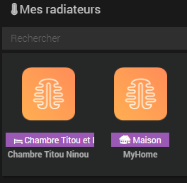
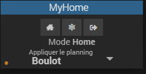
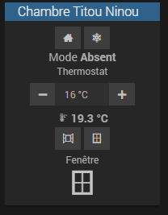

# Plugin Muller Intuitiv

Plugin qui permet de récupérer les radiateurs de l'application mobile [Muller Intuitiv](https://www.muller-intuitiv.com/).

# Configuration du plugin

Après avoir **Activer** le plugin dans la partie configuration renseigner les informations suivantes :
* Le login
* Le mot de passe

Qui correspondent aux identifiants pour vous connecter à l'application **Muller Intuitiv** et cliquer sur **Sauvegarder**
dans la partie **Configuration**

# Synchronisation des radiateurs
Dans la gestion du plugin, cliquer sur **Synchroniser l'installation** vous allez avoir tout vos radiateurs + une partie Home.

Ca active et rend visible les équipements automatiquement.

Après la synchronisation vous devez voir apparaitre ceci. 

# Utilisation du widget Home

Vous avez 3 modes qui **s'applique à tous les radiateurs de la maison** avec un changement de couleur :
* Home -> Utilisation du planning appliquer
* Hors Gel -> Met en mode Hors Gel à 7°c par défaut de l'application
* Absent -> Met en mode Absent à 16°c par défaut de l'application

Vous pouvez appliquer le planning qui vous convient par exemple un pour le boulot et un autre pour les vacances, créer
via l'application.

# Utilisation du widget Radiateur

Vous avez 3 modes qui s'applique au radiateur lui même avec un changement de couleur :
* Home -> Utilisation du planning appliquer
* Hors Gel -> Met en mode Hors Gel à 7°c par défaut de l'application
* Manuel -> En cliquant sur le + ou - du Thermostat (temps du mode manuel indiqué dans l'application mobile 
  dans **Paramètres de chauffe** -> **Durée par défaut d'un dérogation**) et pour sortir du mode manuel passer en mode **Home**.

Vous avez la détection de la fenêtre si c'est ouvert ou pas et de pouvoir lui dire que c'est ouvert ou fermer.
Par exemple en le combinant avec un détecteur d'ouverture et fermeture de fenêtre par scénario.

# Panel : consommation jours/weeks/mois

Pour l'activer aller dans la configuration du plugin

Cocher **Afficher le panneau desktop** puis cliquer sur **Sauvegarder**

Et vous l'aurez dans **Accueil -> Muller Intuitiv** pour avoir ça

